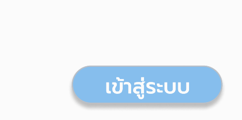
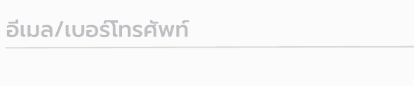
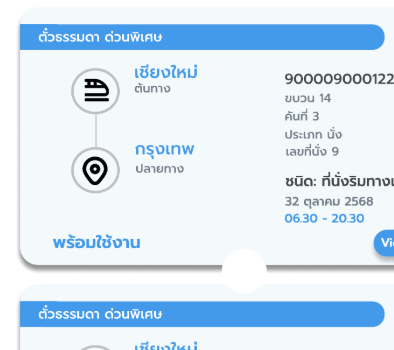
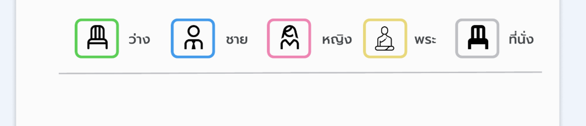

# train-ticket-booking-ui

A complete UX/UI case study and high-fidelity mobile app design for a train ticket booking and real-time tracking system, created using Figma.

---

## Project Overview
This project features a full mobile app design flow, including:

- User login & registration  
- Trip search and train selection  
- Passenger information input  
- Seat selection  
- Payment process  
- QR code ticket  
- Real-time GPS train tracking  

The design includes 30+ high-fidelity screens with a clean, modern style.

---

## Flow Details

### Registration
1. Users open the app and select the **Register** menu.
2. Enter personal information such as first and last name, ID card number, phone number, and password.
3. The system verifies the information and creates an account.
4. Upon registration, a confirmation message will be displayed and the user will be directed to the login page.

### Booking
1. Users select the **Book a Ticket** menu and specify the departure and destination time, travel date, and number of passengers.
2. The system will search and display the **List of Trains** available for that day.
3. Select the desired travel time/train.
4. Enter individual passenger information (name, gender, nationality, etc.).
5. Select a **Seat** via the interactive seating chart.
6. Review the booking details on the **Booking Summary** page (route, seat, fare, tax).

### Payment
1. Select a payment method (the system uses QR Code PromptPay).
2. The system will display a QR code and the payment amount. The user can scan it to complete the payment.
3. Upon completion of the payment, the system will display the **Payment Successful** page or **Payment Failed** page if there is a problem.
4. If successful, the system will generate and display a QR code for boarding the train.

### Real-time Tracking (Train Tracking)
1. Users can access the **Train Tracking** menu. **Train Tracking**
2. Enter the train code/ticket number or select from my ticket list.
3. The system will retrieve the GPS location and display a map with the real-time status of the train (arriving station and whether it is delayed).
4. Users can zoom/pan the train route and close the route once tracking is complete.

---
## SystenOverview

---

## UI Screenshots

> All images are located in the `/screenshots/` folder.

### Authentication
**Login**  

**Register**  

---

### Dashboard

---

### Booking Flow

**Search Trip**  

**Train List**  

**Passenger Info**  

**Seat Selection**  

**Booking Summary**  

---

### Payment

**Payment**  

**Payment Success**  

---

### Real-Time Tracking

**Tracking**  

**Tracking Search**  

---

### QR Ticket

---

## Tools Used
- Figma (UI Design & Prototyping)
- Wireframing & UX Planning
- Component-based UI
- Mobile-first design

---

## Figma Prototype  
https://www.figma.com/design/W3cm8DGf5cbph58miAZe3I/Train?node-id=0-1&t=6jFt9IMuThBU2kMf-1

---

## Summary
This UI project demonstrates:

- UX flow design  
- High-fidelity UI creation  
- Payment & seat-selection UI  
- Real-time train tracking UX  
- Clean component-based mobile UI  

##  Problems & Solutions

### Problem 1: Long booking process
**Solution:** Combine search → seat → payment into a guided step-by-step flow.

### Problem 2: No real-time tracking
**Solution:** Add GPS tracking with live map and train status updates.

### Problem 3: Confusing payment confirmation
**Solution:** Redesign success screen with clear messages & ticket access.

# train-ticket-booking-ui

A complete UX/UI case study and high-fidelity mobile app design for a train ticket booking and real-time tracking system, created using Figma.

---

## Design System

| Type        | Color Preview | Hex      |
|-------------|---------------|---------|
| Primary     |  | `#8FC1E9` |
| Light Blue  |  | `#EEF3FA` |
| Card BG     |  | `#FAFAFA` |
| Divider     |  | `#CAD3DC` |
| Text Dark   |  | `#8C8A8B` |

### Typography
| Style | Font | Weight | Size |
|------|------|-------|------|
| H1   | Inter | Bold | 24px |
| H2   | Inter | Semi-Bold | 20px |
| Body | Inter | Regular | 16px |
| Caption | Inter | Light | 12px |

### Components
Below are core UI components extracted from the Figma prototype. All images are located in `components`.

| Component | Image | Description |
|-----------|------|-------------|
| **Primary Button** |  | ใช้สำหรับ action หลัก เช่น “เข้าสู่ระบบ”, “ค้นหา” |
| **Input Field** |  | ช่องกรอกข้อมูล พร้อมเส้นขอบที่เน้นสถานะ focus |
| **Train Ticket Card** |  | การ์ดแสดงข้อมูลตั๋ว เช่น เส้นทาง โค้ชที่นั่ง สถานะ |
| **Seat Legend** |  | แสดงไอคอนที่นั่งพร้อมสี: ว่าง, สำหรับชาย, สำหรับหญิง, สำหรับพระ, ไม่ว่าง |
| **Navigation Bar** |  | แถบล่างสำหรับนำทางไปหน้า Home, My Tickets, Notifications, Account |
| **QR Ticket Card** |  | การ์ดตั๋วพร้อม QR code สำหรับสแกนขึ้นรถไฟ |

