# train-ticket-booking-ui

A complete UX/UI case study and high-fidelity mobile app design for a train ticket booking and real-time tracking system, created using Figma.

---

## 📌 Project Overview
This project features a full mobile app design flow, including:

- User login & registration  
- Trip search and train selection  
- Passenger information input  
- Seat selection  
- Payment process  
- QR code ticket  
- Real-time GPS train tracking  

The design includes 30+ high-fidelity screens with a clean, modern style.

---

## 🧭 User Flow

---

## 🖼️ UI Screenshots

> All images are located in the `/screenshots/` folder.

### 🔐 Authentication
**Login**  
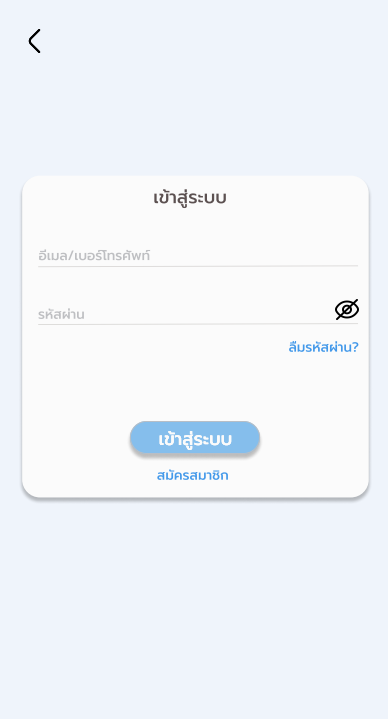

**Register**  
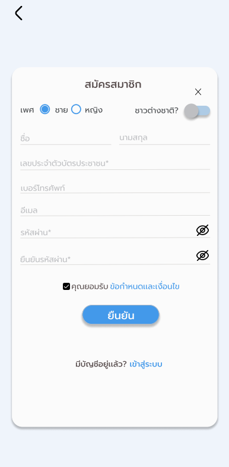

---

### 🏠 Dashboard
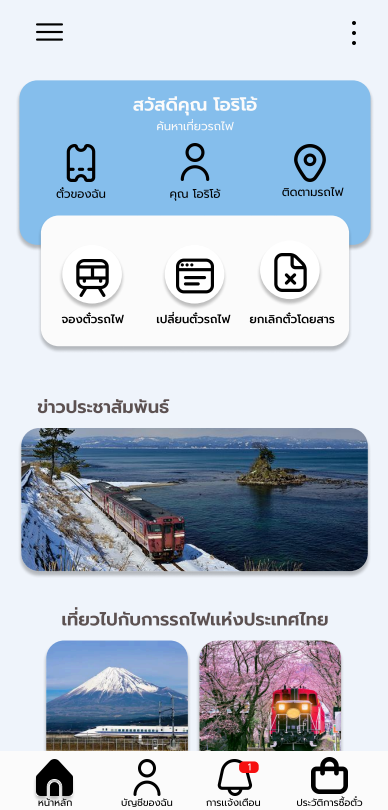

---

### 🚆 Booking Flow

**Search Trip**  
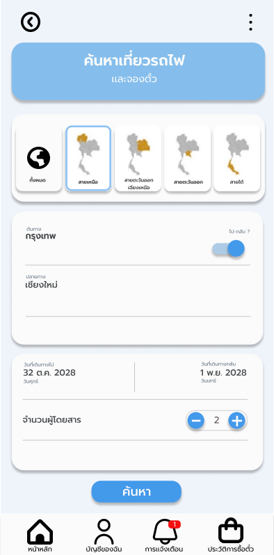

**Train List**  
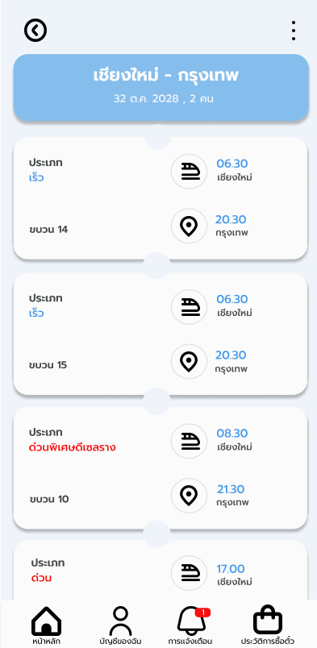

**Passenger Info**  
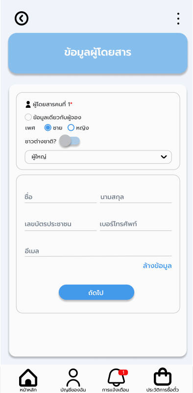

**Seat Selection**  
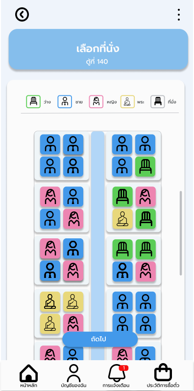

**Booking Summary**  
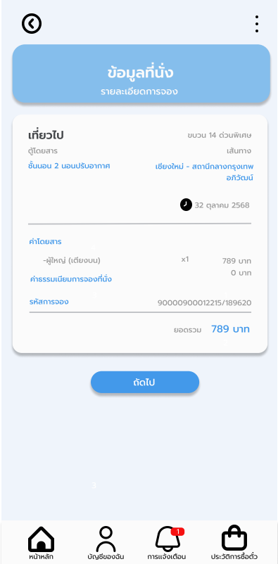

---

### 💳 Payment

**Payment**  
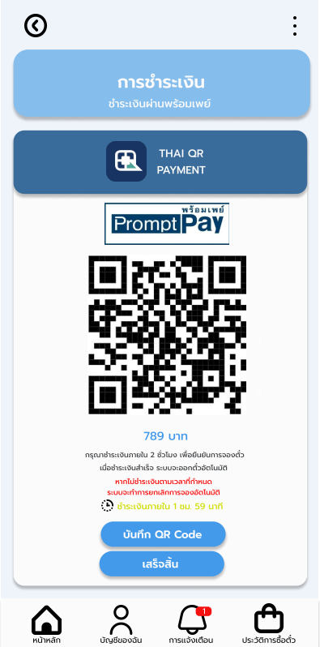

**Payment Success**  
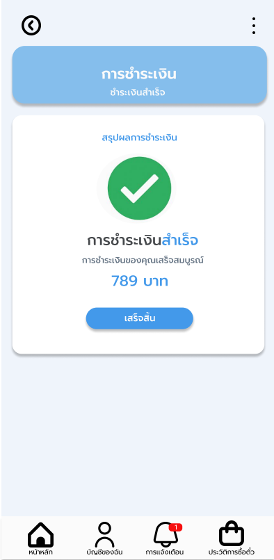

---

### 📍 Real-Time Tracking

**Tracking**  

**Tracking Search**  
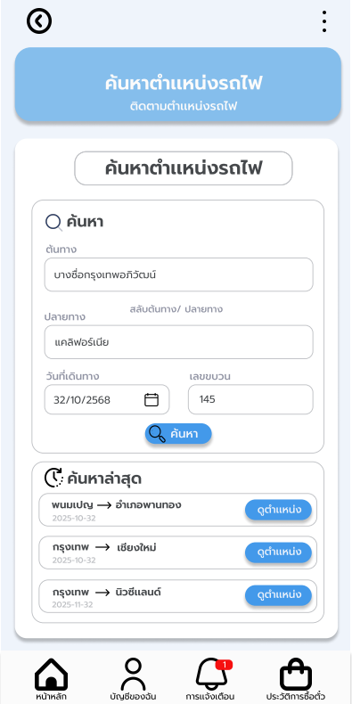

---

### 🎫 QR Ticket
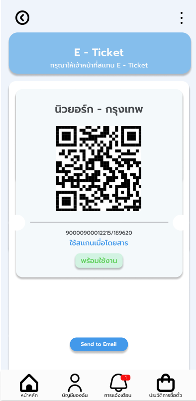

---

## 🧰 Tools Used
- Figma (UI Design & Prototyping)
- Wireframing & UX Planning
- Component-based UI
- Mobile-first design

---

## 🔗 Figma Prototype  
https://www.figma.com/design/W3cm8DGf5cbph58miAZe3I/Train?node-id=0-1&t=6jFt9IMuThBU2kMf-1

---

## ⭐ Summary
This UI project demonstrates:

- UX flow design  
- High-fidelity UI creation  
- Payment & seat-selection UI  
- Real-time train tracking UX  
- Clean component-based mobile UI  

Perfect for a **UX/UI portfolio** or **front-end showcase**.
## ❗ Problems & Solutions

### Problem 1: Long booking process
**Solution:** Combine search → seat → payment into a guided step-by-step flow.

### Problem 2: No real-time tracking
**Solution:** Add GPS tracking with live map and train status updates.

### Problem 3: Confusing payment confirmation
**Solution:** Redesign success screen with clear messages & ticket access.

# train-ticket-booking-ui

A complete UX/UI case study and high-fidelity mobile app design for a train ticket booking and real-time tracking system, created using Figma.

---

## 🎨 Design System

### Color Palette (จาก Figma จริง)
| Type      | Color Preview | Hex      |
|-----------|---------------|---------|
| Primary   |  | `#8FC1E9` |
| Light Blue|  | `#EEF3FA` |
| Card BG   |  | `#FAFAFA` |
| Divider   |  | `#CAD3DC` |
| Text Dark |  | `#8C8A8B` |

### Typography
| Style | Font | Weight | Size |
|------|------|-------|------|
| H1   | Inter | Bold | 24px |
| H2   | Inter | Semi-Bold | 20px |
| Body | Inter | Regular | 16px |
| Caption | Inter | Light | 12px |

### Components
Below are core UI components extracted from the Figma prototype. All images are located in `screenshots/components/`.

| Component | Image | Description |
|-----------|------|-------------|
| **Primary Button** |  | ใช้สำหรับ action หลัก เช่น “เข้าสู่ระบบ”, “ค้นหา” |
| **Input Field** |  | ช่องกรอกข้อมูล พร้อมเส้นขอบที่เน้นสถานะ focus |
| **Train Ticket Card** |  | การ์ดแสดงข้อมูลตั๋ว เช่น เส้นทาง โค้ชที่นั่ง สถานะ |
| **Seat Legend** |  | แสดงไอคอนที่นั่งพร้อมสี: ว่าง, สำหรับชาย, สำหรับหญิง, สำหรับพระ, ไม่ว่าง |
| **Navigation Bar** |  | แถบล่างสำหรับนำทางไปหน้า Home, My Tickets, Notifications, Account |
| **QR Ticket Card** |  | การ์ดตั๋วพร้อม QR code สำหรับสแกนขึ้นรถไฟ |

